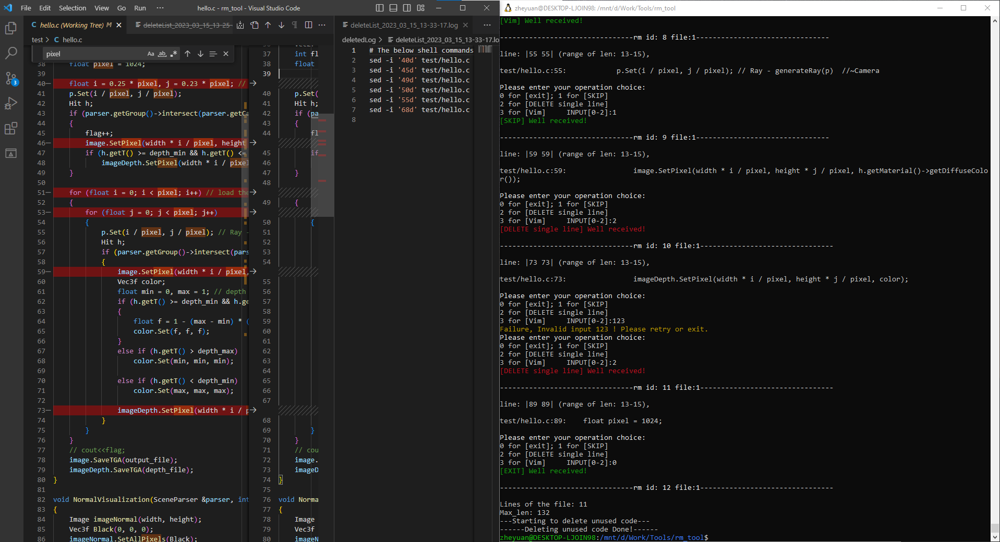

# rm_tool Linxu
Integration of search, view and delete using Linux System Call ack, vim and sed.
In addition, there are others system calls integrated, like clear screen.
By choosing the right mode, you could do nearly everthing, including any linux command.

Make use of enum, switch, file handling in C, system call.
## How to Use
Place this repo at the same directory as your working_folder (to be cleaned and deleted).
```
- rm_tool
- working_folder
```
### Initiate the tools needed
```
./rm.sh -i
```
Install the tools needed and have test sets updated.
### Usage
```
./rm.sh -h
Usage ./rm.sh ... 
(See more using the above command.)
```
## Pipeline
ack > search_res.log

src/main.c process the log (read and rm)

remove specific lines using Linux system call.

sed -i '4d' 'test/fops.h'
sed -i '1,2d' 'test/fops.c'

generate deletedLog with timestamp.

**buffer** size fixed at 1000.
## Choice：
1. skip
2. rm variable/single line <br/>
    No need to flush, since it's restricted to a subset of lines.
3. vim  <br/>
    flush -> redo ack search
4. rm specific lines  <br/>
    Delete Multiple Lines is asynchronous, it will trigger flush and reload by design <br/>
    ADD acknowledge confirmation, and could AVOID future warning by using variable  bool future_acknowledge=true; <br/>
5. ack
6. rm file
7. rm function


cd /mnt/d/Work/Tools/rm_tool