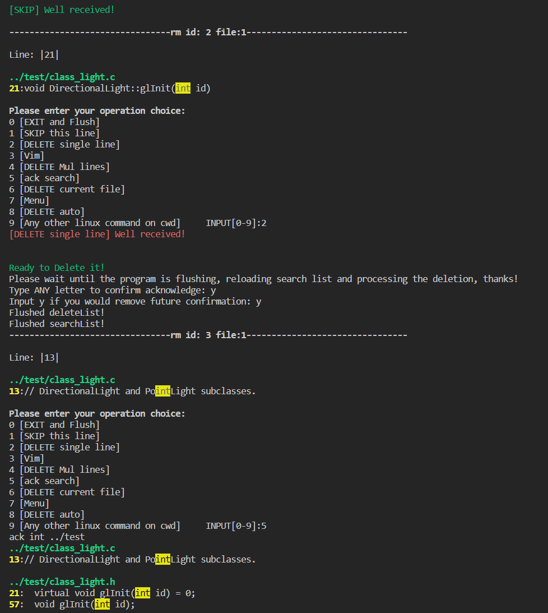

# rm_tool Linux
Integration of search, view and delete using Linux System Call ack, vim and sed.

Full support of ANY ack command!

In addition, there are others system calls integrated, like clear screen.
By choosing the right mode, you could do nearly everthing, including any linux command.
```
--- ****** --- WELCOME to USE rm_tool 2023:) --- ****** ---

*
***
*****
*******
*********
***********
*************
***********
*********
*******
*****
***
*
File Name: |backup_test/class_light.h|   Line: |10|

backup_test/class_light.h:10:class Light

Please enter your operation choice:
0 [EXIT and Flush]
1 [SKIP this line]
2 [DELETE single line]
3 [Vim]
4 [DELETE Mul lines]
5 [ack search]
6 [DELETE current file]
7 [Menu]
8 [DELETE auto]
9 [Any other linux command on cwd]     INPUT[0-9]:
```

Make use of enum, switch, file handling in C, system call.
## How to Use
Place this repo at the same directory as your working_folder (to be cleaned and deleted).
```
- rm_tool
- working_folder
```
### 1. Initiate the tools needed
```
./rm.sh -i
```
Install the tools needed and have test sets updated.
### 2. Usage
```
./rm.sh -h
(See more using the above command.)
```
```
Quick start  ./rm.sh -i (initializing & *clean*ing log)
             ./rm.sh pixel ../test [-d]

Usage   ./rm.sh SEARCH_WORD PATH  [-d]
           e.g. pixel     ../test [-d]

Advanced ./rm.sh SEARCH_WORD PATH [Other ack cmd] [-d]
           e.g. pixel     ../test -i [-d]
                See more using ack --help
                                   enter tool searching the keyword provided
        Optional:
                -d                 appending ack cmd to disable warning
                                   Caution: need to be the last one!

        Others:
                -i  -init          initialize & *clean* log
                -e  -error         show the last time debug log
                -h  -help          display this help and exit
                -c  -clear         clear screen
                -t NUM             for dev and test
        Choice:
                  -t 1 is -w pixel -p ../test -d
                  -t 2 is -w pixel -p ../test
```
### 3. Menu
0. [EXIT and Flush]
1. [SKIP this line]
2. [DELETE single line] rm variable/single line <br/>
    v1: No need to flush, since it's restricted to a subset of lines.

    v2: Direct flushing, enabling multiple choices
3. [Vim]  <br/>
    v1: flush -> redo ack search
    
    v2: no need to flush when exec Vim.
4. [DELETE Mul lines] rm specific lines  <br/>
    v1: Delete Multiple Lines is asynchronous, it will trigger flush and reload by design <br/>
    ADD acknowledge confirmation, and could AVOID future warning by using variable  bool future_acknowledge=true; <br/>

    v2: No need to flush deleteList this time.
5. [ack search] ack
6. [DELETE current file] rm file
7. [Menu]
8. [DELETE auto] rm block of code, 
     e.g. function, class, struct, declaration<br/>
     Caution: So far, only support no unpairing curly braces in the comment.<br/> 
     TO BE DONE: Untrace things in the comment.<br/>
      For things like class, ending }; needs to be on the same line.
9. 9 [Any other linux command on cwd]
     

Determine whether or not to flush deleteList and searchList depend on the properties of the function, whether it will read / write the state.

## Pipeline
ack > search_res.log

src/main.c process the log (read and rm)

remove specific lines using Linux system call.

sed -i '4d' 'test/fops.h'
sed -i '1,2d' 'test/fops.c'

generate deletedLog with timestamp.

**buffer** size fixed at 1000.

## Update
### Update 20 Mar 2023
Add memory of the skipped file;
Add highlight;
Fix bugs

cd /mnt/d/Work/Tools/rm_tool
